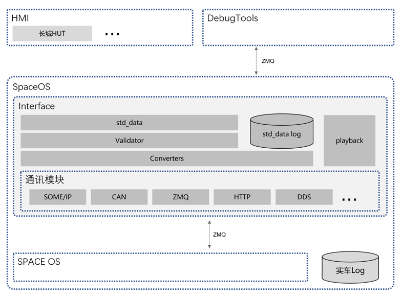
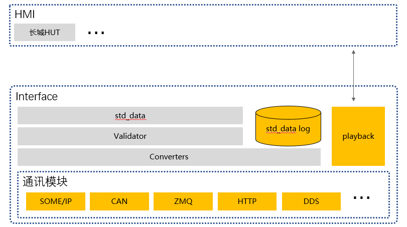
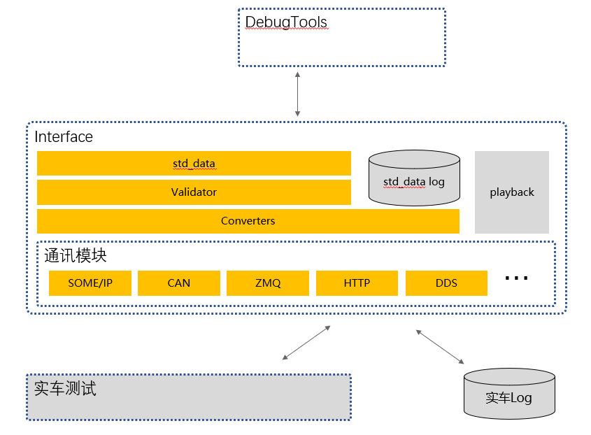

# 设计理念

## Why?

我们为什么需要interface模块:

1. 车型不同：不同的汽车的车身参数、传感器配置不同，需要的功能也不同
2. 通讯方式不同：不同的合作方采用的通讯方式不一致

因此，Interface模块的设计理念为：

1. 兼容不同车型：Interface模块提供的接口会根据不同的车辆而调整。
2. 兼容不同通讯方式：Interface提供了数个通讯模块，合作方可以自行选择接口。

## 架构

Interface是SpaceOS中的一个模块，负责向外部系统提供统一的接口。但Interface是一个相对独立的模块, 可以独立启动。其主要架构为（见下图）：

1. 数个通讯模块：以提供SOME/IP、CAN、ZMQ等各种不同的通讯模式。
2. Converters、Validator、std_data：负责把各种厂商不同的通讯内容统一为SpaceOS标准数据(`std_data`)。
3. playback：可以提供各种回放数据、模拟数据，供HMI解耦测试。

## HMI解耦

Interface希望能做到前端（HMI、DebugTools）和后端的解耦。

如下面的架构图，HMI开发者可以不启动Space主系统，独立启动Interface模块。使用`playback`模块播放各种典型数据，独立进行开发测试。

而对于后端开发者，Interface的`Validator`模块会对Space主系统发送的各种报文进行检查，如测量值，帧数等。后端开发者可以启动`DebugTools`帮组调试后端。

