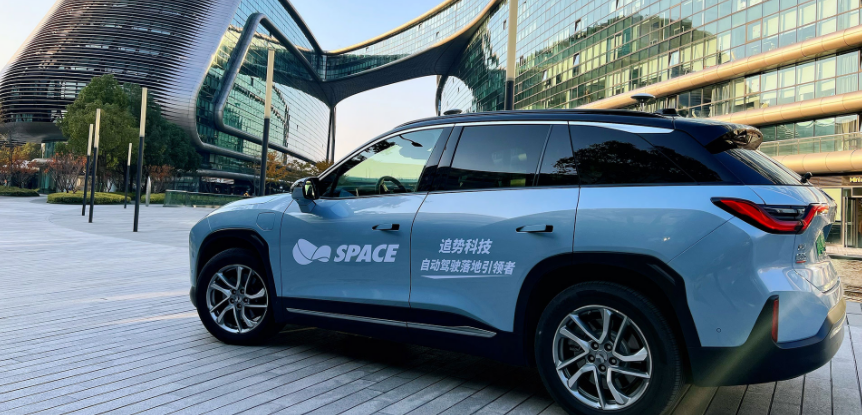

# 简介

追势科技是一家致力于L3级以上自动驾驶技术研发，为乘用车车厂和上下游提供全栈的自动驾驶解决方案。追势科技打造的SPACE-AI多传感器融合软件平台能够兼顾L3-L5的高阶自动驾驶软件和算法开发，并能够适配所有的主流量产芯片平台，以极小的适配开发成本，完成软件和算法的量产落地。

## Interface

为了方便客户整合SPACE OS，我们制作了Interface模块，其能提供标准化的通讯接口和内容。

Interface包含：

 1. 一套标准通讯内容：用于约定SPACE-AI能提供的信息和控制功能。

 2. 数个基于各种通讯协议编制的通讯模块，如SOME/IP、CAN、HTTP等。方便客户选用其熟悉的通讯方式。

 3. 一些调试工具，用于帮助客户加快调试进度。

    

> 本项目还处于开发当中，有任何问题，请联系[Zhi.Zhao](zhi.zhao@space.top)。
