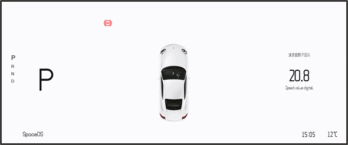

# 车辆接口

车辆接口提供车辆的各种信息，获得车辆的配置于实时状态信息。

## 车辆配置

`/vehicle/info`

| 内容               | Key                   | Value | 格式  | 单位 | 范围 | 示例 |
| ------------------ | --------------------- | ----- | ----- | ---- | ---- | ---- |
| 车辆长             | vehicle_length        |       | float | 米   |      |      |
| 车辆宽             | vehicle_width         |       | float | 米   |      |      |
| 车辆高             | vehicle_height        |       | float | 米   |      |      |
| 车辆轴距           | vehicle_axles_length  |       | float | 米   |      |      |
| 前轴到前保险杠距离 | vehicle_front_to_bump |       | float | 米   |      |      |
| 后轴到后保险杠距离 | vehicle_rear_to_bump  |       | float | 米   |      |      |

## 车辆状态

`/vehicle/status`

| 内容           | Key         | Value                          | 格式  | 单位 | 范围 |      |
| -------------- | ----------- | ------------------------------ | ----- | ---- | ---- | ---- |
| 车速           | speed       |                                | float | km/h |      |      |
| 车辆限速       | speed_limit |                                | float | km/h |      |      |
| 档位           | gear_state  | 0:P档   1:N档   2:D档    3:R档 |       |      |      |      |
| 方向盘转角     | steer_angle | -550~550                       |       | 度   |      |      |
| 油门（电门）   | accelerator | 0~1(0:松开油门, 1：油门全开）  |       |      |      |      |
| 刹车           | break_pedal | 0~1(0:松开刹车, 1：刹车全闭）  |       |      |      |      |
| ==刹车灯状态== |             |                                |       |      |      |      |
| ==xx灯状态==   |             |                                |       |      |      |      |

## 智驾状态

/vehicle/status/intelligent_drive

智能驾驶配置：

| 内容         | Key            | Value                     | 格式 | 单位 | 范围 |      |
| ------------ | -------------- | ------------------------- | ---- | ---- | ---- | ---- |
| 驾驶模式列表 | auto_mode_info | ["1":"APA","2":"HAVP"...] |      |      |      |      |

| 内容         | Key       | Value                                                        | 格式 | 单位 | 范围 |      |
| ------------ | --------- | ------------------------------------------------------------ | ---- | ---- | ---- | ---- |
| 驾驶模式     | auto_mode | 0：无意义    1：Emergency Stop 2: AVP  3: HAVP  4: 召唤 |      |      |      |      |
| ==车辆位置== | pos       | (float,float,float)                                          |      |      |      |      |

## 车辆报警

用于收集车辆的各种报警状态。

==本部分和APA HAVP关系较小，优先级底==
