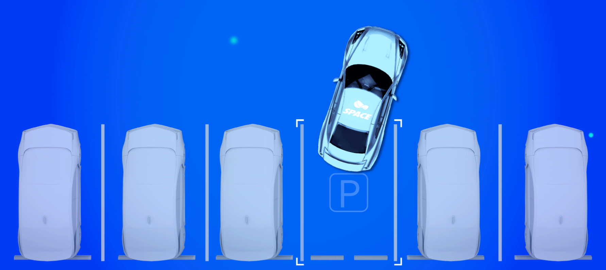

# APA流程接口

APA（Auto Parking Asist）自动泊车是生活中最常见的泊车辅助系统。泊车辅助系统在汽车低速巡航时，使用传感器感知周围环境，帮助驾驶员找到尺寸合适的空车位，并在驾驶员发送泊车指令后，将汽车泊入车位。

## 状态接口

| 接口              | key                                                          | value                                                        |
| ----------------- | ------------------------------------------------------------ | ------------------------------------------------------------ |
| ==xx状态？==      | APS_status                                                   | 0x0:Disable  0x1:Standby  0x2:Searching 搜索库位 0x3:Guidance 导航  0x4:Failed  0x5:Wait for Engine restart  0x6~0X7:Reserved |
| APA功能状态       | APA_FuncSts                                                  | 0x0: standby  0x1: active  0x2: disable  0x3:Reservedap |
| ==APA??==         | APA_MenuDispCtr lCmd                                         | 0x0:No_Disp_avm_menu  0x1:park_in_indicate_menu  0x2:park_in_select_slot_menu  0x3:park_in_mode_select_menu  0x4:park_in_process  0x5:remote_park_in_process  0x6:park_out_confirm_menu  0x7:park_out_process 0x8:park_in_indicate_menu_NoRPA  0x9:park_in_select_slot_menu_NoRPA  0xA:park_in_mode_select_menu_NoRPA  0xB:park_out _indicate_menu  0xC:User_Defined_Parking_Slot_Menu  0xD:park_in_RemoteSearchingSlot_menu  0xE:PAVP_screen_section_A 0xF:Reversed |
| 显示提示信息      | APS_TextDisp                                                 | 详见《提示列表》...                                          |
| ==？==            | HAP_SwtDispCtrl Cmd                                          | 0x0:no display  0x1:park out direction Select menu  0x2:continue park menu  0x3:Study finish button  0x4:continue RADS menu  0x5:continue FADS menu  0x6~0x7:Reserved |
| 泊车进度          | ProcBar                                                      | 0x0-0x64: 0~100%  0x65-0x7E: Reserved  0x7F: No Display |
| 播放报警音        | sound                                                        | 0x0:Tone 0 - No Warning  0x1:Tone 1 - failed tone  0x2:Tone 2 - successful tone  0x3:Tone 3 - warning tone  0x4:Tone 4 - request tone 0x5~0x7:Reserved |
| ==atparkgrage==   | 0：IDEL 1:地库内   2：地库外                                 |                                                              |
| distance_parking  | [float,float,float,float] [总泊车距离，泊车剩余行驶距离，本次操作总行驶距离，本次操作剩余行驶距离]，单位米 |                                                              |
| distance          | 距离车位距离，单位米                                         |                                                              |
| avoid_pedestrian  | 避让行人次数                                                 |                                                              |
| avoid_vehicle     | 避让车辆次数                                                 |                                                              |
| distance_learning | 学习距离  单位米                                             |                                                              |
| bumper_num        | 减速带条数                                                   |                                                              |
| prompt            | 系统提示 0:无 1：开出地库回到地面  2：从地库出口驶离约200米  3：重新回到起点 |                                                              |
| driving_state     | 0:IDEL 1:直行   2:左转    3:右转   4:路口请注意   5:等待前车行驶  6:即将到达指定车位 |                                                              |
| MapDevPercentage  | 建图百分比，0~100                                            |                                                              |
|                   |                                                              |                                                              |

## 控制接口

| 接口                     | key                                                          | value                                                        |
| ------------------------ | ------------------------------------------------------------ | ------------------------------------------------------------ |
| 进入\退出 APA功能        | Enable_APA                                                   | 0x0: select  0x1: cancel                                |
| 选择泊入车位             | select_parking_lot                                           | 0x0~0x1F                                                     |
| 选择泊车模式             | PrkgCtrlModReq                                               | 0x0:No action  0x1:Parking in car  0x2:Remote parking  0x3:Remote searching slot |
| 设置泊出方向             | SelPrkOutDirReq                                              | 0x0:No selection  0x1:Park out front/vertical head out  0x2:Park out rear/vertical tail out  0x3:Park out left/parallel left out  0x4:Park out right/parallel right out  0x5-0x7:Reserved |
| 开始泊车                 | StartParkCmd                                                 | 0x0:No_Request  0x1:Request                             |
| ==pathid==               |                                                              | 路径id                                                       |
| ==mapid==                |                                                              | 地图id                                                       |
| ==BtnEnaReq_modestatus== | 0x0:None  0x1:Mapbuilt_weak_active  0x2:HAVP_active_signal  0x3:Confrim_mapbuilt  0x4:Change_route  0x5:Confrim_start_parking  0x6:Parking_in_weak_active  0x7:Cancel  0x8:Continue_HAVP 0x9:Map_build_completed_click  0xA:HAVP_function_open  0xB:HAVP_function_closed  0xC:Weak_alert_function_open  0xD:HAVP_Weak_alert_function_closed  0xE:Learning_completed  0xF:Cancel_current_weak_active_button  0x10:SVP_function_open  0x11:SVP_function_closed  0x12:Start_HAVP_VR  0x13:Start_SVP  0x14:Start_SVP_VR  0x15:Try  0x16:Continue_Learn  0x17:Search_Slot_along_way  0x18:HAVP_Completed | 开关点击信号                                                 |
| ==BtnEnaReq==            | 0 //0:default   1:扫库  2:开始泊入车位   3:继续   4:退出  5:确认学习   6:完成学习   7:退出指引    8:开始记忆泊车  9:恢复记忆泊车  10:遥控泊车 11:遥控泊车返回  12: 停止学习（学习失败）  13:PAVP开始 | 开关点击信号                                                 |

