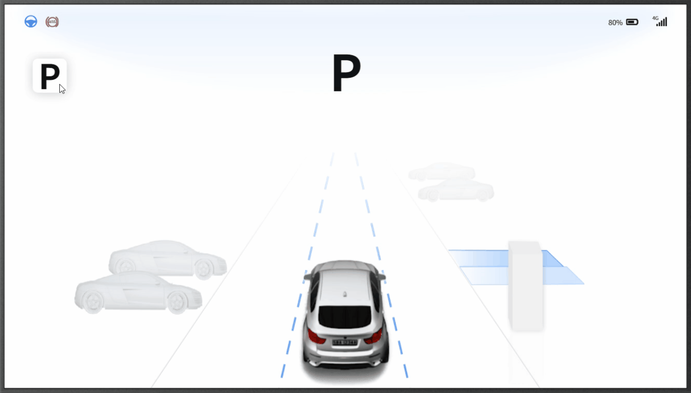

# SPACE OS 自动驾驶 推荐设计

SpaceOS 根据在自动泊车和自动驾驶行业的多年实践，总结出一套"推荐设计"，建议我们的客户采用。

## 介绍

自动驾驶主要分为两个窗口：控制窗口及还原世界窗口，如下图。

## APA 流程介绍

当系统未识别可以自动导航的路线时，操作者依然可以点击“P”按钮展开“控制窗口”。此时，该窗口会提示操作者未匹配到任何路线。操作者可以点击取消关闭窗口，或者点击设置进行地图的增、删，或者进行泊车系统的各种设置。

