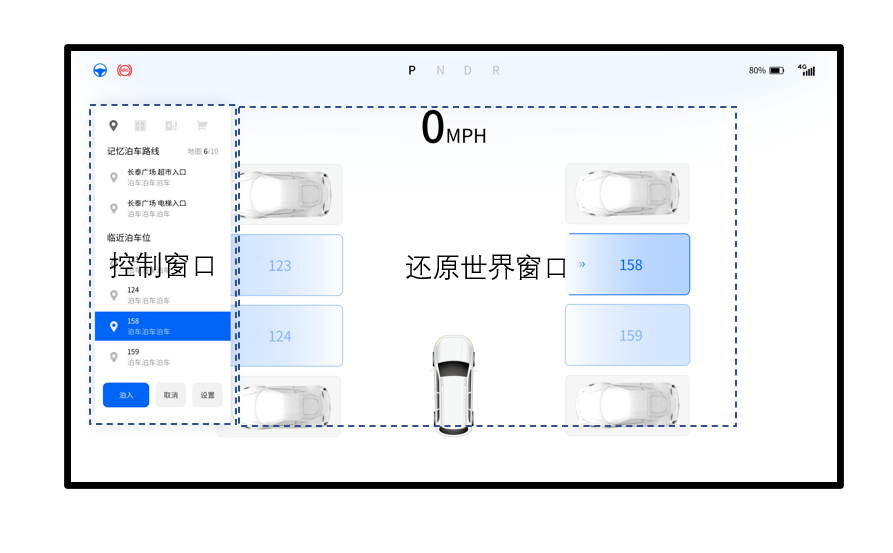

# SPACE OS 自动驾驶 推荐设计

SpaceOS 根据在自动泊车和自动驾驶行业的多年实践，总结出一套"推荐设计"，建议我们的客户采用。

## 介绍

自动驾驶主要分为两个窗口：控制窗口及还原世界窗口，如下图。

## APA 流程介绍

当系统未识别可以自动导航的路线时，操作者依然可以点击“P”按钮展开“控制窗口”。此时，该窗口会提示操作者未匹配到任何路线。操作者可以点击取消关闭窗口，或者点击设置进行地图的增、删，或者进行泊车系统的各种设置。

### 自动匹配

驾驶过程中，如果系统匹配到可泊车路径，会弹出`提示窗`提示操作者已经匹配到泊车路径。并提示操作者刹车。

有一个进度条提示客户刹车的进度。随着车速的降低，视角会由车尾部视图逐步转为顶视图。

当车速降低为0时，`提示窗`会下拉展开，变为`路线选择窗口`。

如果仅匹配到了停车位，则显示状况如上图。如果匹配到了记忆停车位，则`提示窗`显示内容如下：

### 路线选择窗口

`路线选择窗口`展示了所有的自动驾驶路线，如可泊入的车位、可使用的记忆泊车路线等。操作者可以自由的选择路线，同时`还原世界窗口`会相应的展示所选中的路线。

当操作者选择的是记忆泊车路线时，`还原世界窗口`显示的是整个停车场的总览3D图。操作者可以通过触摸操控还原世界窗口，绕轴向旋转查看路线，为了方便查看，只能绕一个轴旋转。

当操作者选择的是临近泊车位时，还原世界窗口显示的是车辆的顶视图，及身边的可泊车位。操作者即可以在还原世界窗口中点选，也可以在`路线选择窗口`中点选。

