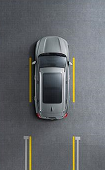
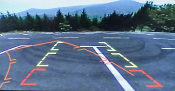
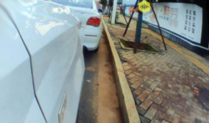
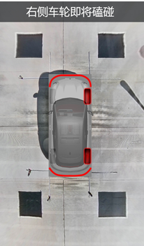

# 超声波传感器信息

所有图片接口均传输字节流。

## 环视图片

设置接口：

1. 打开、关闭环视视频数据推送
2. 获得环视数据信息，如分辨率、推送频率。
3. 是否绘制告警图像：
   1. 超声图像1~ 2 ~ #

## 后视图片

设置接口：

1. 打开、关闭后视视频数据推送
2. 获得后视信息：如分辨率、推送频率。
3. 是否绘制告警图像：

## 3D环视

==我们来绘制==？

## 侧面盲区视频

提供侧面盲区视频

## 车轮磕碰告警

