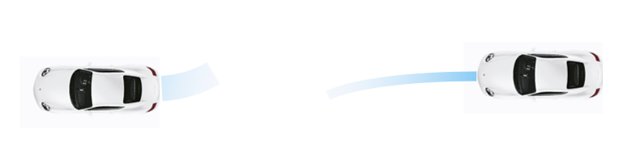
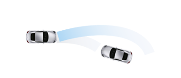

# 轨迹线

## 线段基础

系统支持如下几种路线：

| 内容        | Key                   | Value | 格式  | 单位 | 范围 | 示例 |
| ----------- | --------------------- | ----- | ----- | ---- | ---- | ---- |
| x           | vehicle_length        |       | float | 米   |      |      |
| y           | vehicle_width         |       | float | 米   |      |      |
| z           | vehicle_height        |       | float | 米   |      |      |
| orientation | vehicle_axles_length  |       | float | 米   |      |      |
| length      | vehicle_front_to_bump |       | float | 米   |      |      |

## 车辆行进路线

##  换道

##  Lanes （车道）

## 减速带 bumper

