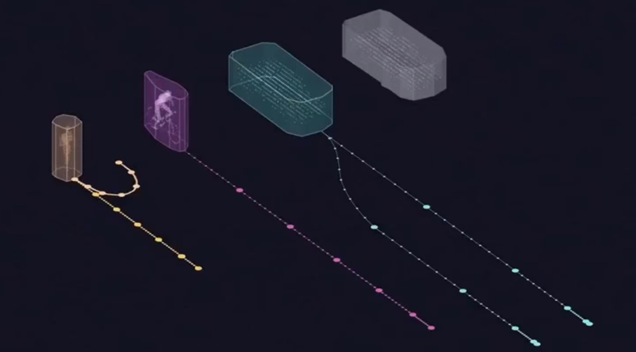
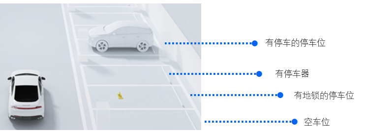

# 障碍物

## 通用障碍物



有时候我们无法识别出障碍物的类型，（特别是在使用激光雷达的时候），我们使用“几何体”来描述这个障碍物。

## 停车位



| Key        | Value                                                        | Description                                                  |
| ---------- | ------------------------------------------------------------ | ------------------------------------------------------------ |
| id         | str                                                          | 停车位的唯一识别id,例如：“A101”,"13"等                       |
| coordinate | ((x,y),(x,y))                                                | 停车位的对角坐标，绘制出停车位的矩形框                       |
| status     | 0：可用（空车位）<br />1: 不可用-未指明原因<br /><br />2：不可用 - 有车辆占用<br />3：不可用 - 有地锁占用 | x, y, z 位置，单位                                           |
| stopper    | L                                                            | 停车器距离停车位末端的长度，单位米。==没有必要区分长轮档和短轮档== |

## 障碍物


## Pose

我们从它自己的任意框架定义车辆的位置，以及它在纬度、经度、形式中的位置。

| Name          | Type              | Description                                                  |
| ------------- | ----------------- | ------------------------------------------------------------ |
| `timestamp`   | `float`           | The vehicle/log transmission_time associated with this data. |
| `map_origin`  | `map_origin`      | 地理坐标，也可以叫“世界坐标”                                 |
| `position`    | `array<float>(3)` | x, y, z 位置，单位米                                         |
| `orientation` | `array<float>(3)` | 滚动、俯仰、偏航角，单位弧度                                 |

其中 `map_origin` 描述了其地理坐标和海拔:

| Name        | Type    | Description          |
| ----------- | ------- | -------------------- |
| `longitude` | `float` | 东西地理坐标，单位度 |
| `latitude`  | `float` | 南北地理坐标，单位度 |
| `altitude`  | `float` | 海拔高度，单位：米   |

## Location

我们要为 XVIZ 定义的第一个数据是Pose。它是告诉我们车辆位置的核心数据，也是其他数据的共同参考点。

## 物体识别

/vehicle/info

| 内容               | Key                                                          | Value | 格式  | 单位 | 范围 | 示例 |
| ------------------ | ------------------------------------------------------------ | ----- | ----- | ---- | ---- | ---- |
| 障碍物数量         | obstaclenum                                                  |       | float | 米   |      |      |
| 障碍物信息         | 1. pillar 立柱 <br />2. 暂定 <br />3. bumper减速带  <br />4. vehicle 车辆  <br />5. pedestrian 行人   <br />6. Non-motor vehicles 非机动车 <br />7. obstacle 障碍物 <br />8.SnowBucket 雪花桶 <br />9.WarningBoard 警告牌 <br />10.WellLid 圆井盖   <br />11.WellLid 方井盖 <br />12.ParkingLock 地锁 <br />13.WarningColumn 警示柱 <br />14.Lampstandard 灯柱 <br />15、WheelGear 短轮档 <br />16WheelGear 长轮档 |       | float | 米   |      |      |
| 车辆高             | vehheight                                                    |       | float | 米   |      |      |
| 车辆轴距           | vehaxles_length                                              |       | float | 米   |      |      |
| 前轴到前保险杠距离 | vehfronttobump                                               |       | float | 米   |      |      |
| 后轴到后保险杠距离 | vehreartobump                                                |       | float | 米   |      |      |

## 障碍物信息

*/   "pos": [ 0, 0, 0, 0, 0, 0, 0, 0 ], //障碍物四个角点坐标 [posx0, posy0, posx1, posy1, posx2, posy2, posx3, posy3]，单位为米   "angle_global": [ 0, 0, 0 ],   "angle_local": [ 0, 0, 0 ],   "center_global": [ 0, 0, 0 ],   "center_local": [ 0, 0, 0 ] }

## 例子

```js
{
    "points": [
        {
            "points": [[1, 2, 3]]
        }
    ]
}
```

## 物体的速度和加速度

==本部分的优先级较低==

KITTI also defines a number of values for the vehicle. We will be sending acceleration and velocity to demonstrate the plot UI component of XVIZ.

This is how we define the metadata for these streams.

```js
const xb = xvizMetaBuilder;
  // ...
  .stream(this.VEHICLE_ACCELERATION)
  .category('time_series')
  .type('float')
  .unit('m/s^2')

  .stream(this.VEHICLE_VELOCITY)
  .category('time_series')
  .type('float')
  .unit('m/s')
```

The constants used here represent the strings `/vehicle/acceleration` and `/vehicle/velocity` respectively. The `type()` defines the value types of the stream and the lists of [type values](https://avs.auto/#/xviz/protocol/schema/session-protocol?section=stream_metadata) can be in the specification.

The `unit()` is a free form string to define the units that will be displayed in the UI.

The data for each message is converted as follows.

```
xvizBuilder
  .timeSeries(this.VEHICLE_VELOCITY)
  .timestamp(velocity.timestamp)
  .value(velocity['velocity-forward']);

xvizBuilder
  .timeSeries(this.VEHICLE_ACCELERATION)
  .timestamp(acceleration.timestamp)
  .value(acceleration['acceleration-forward']);
```

Using the builder we are setting the stream name with a data type [time_series](https://avs.auto/#/xviz/protocol/schema/core-types?section=time-series-state-). A time_series is a single value that changes as time changes. This is precisely what we want for instantaneous values.

Setting the value is simple, but you may wonder why we are setting the timestamp. The timing of data is important and it may not always align directly with the driving time signal. We want to capture the more accurate time for the data which is why we are setting the timestamp on these values at this point.
